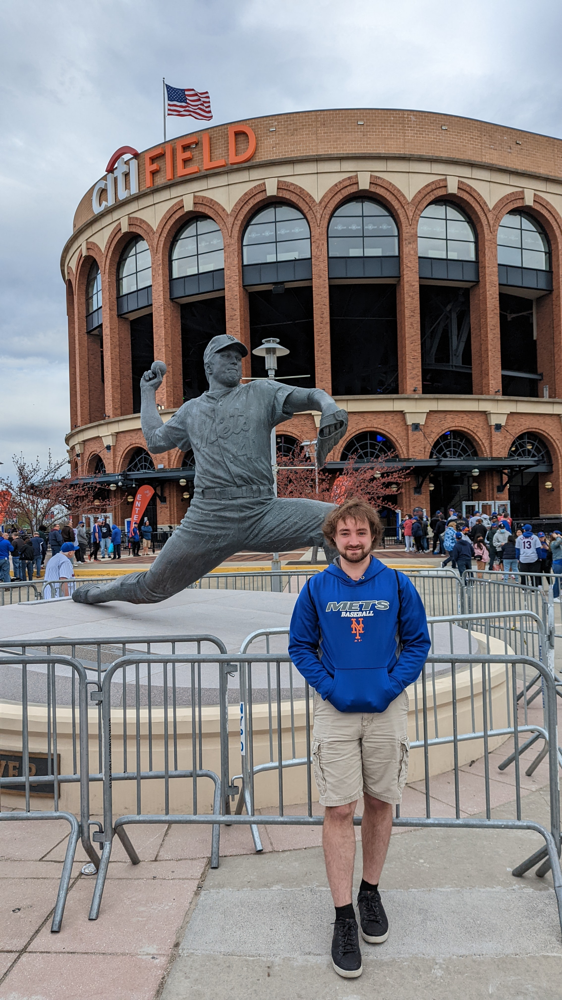

# Chauncey Tanner Murphey

## [About Me](https://ctmurphey.github.io/about) | [Research](https://ctmurphey.github.io/research) | [Other Projects](https://ctmurphey.github.io/projects) | [Contact](http://ctmurphey.github.io/contact)
I'm currently pursuing a Masters in Physics from Stony Brook University. Working under professor Will Farr, I research black hole mass function cosmology using the most recent public LIGO data. I'm also a guest at the Flatiron Institute, where I am a member of the Gravitational Wave Group at the Center for Computational Astrophysics. 

I obtained my Bachelors in Astronomy from the University of Illinois at Urbana-Champaign in May 2020, where I did research in Galactic supernova distributions under professor Brian Fields. I am hoping to start pursuing a PhD thesis after I obtain my Masters, ideally analyzing multimessenger data for transients. 

Outside of classes and research, I'm a huge baseball fan and have recently started dabbling in data science in the sport after watching and playing the sport for most of my life (Lets go Mets!). I've been coding extensively in Python since 2018, mostly in statistical modeling/analysis and data science.

