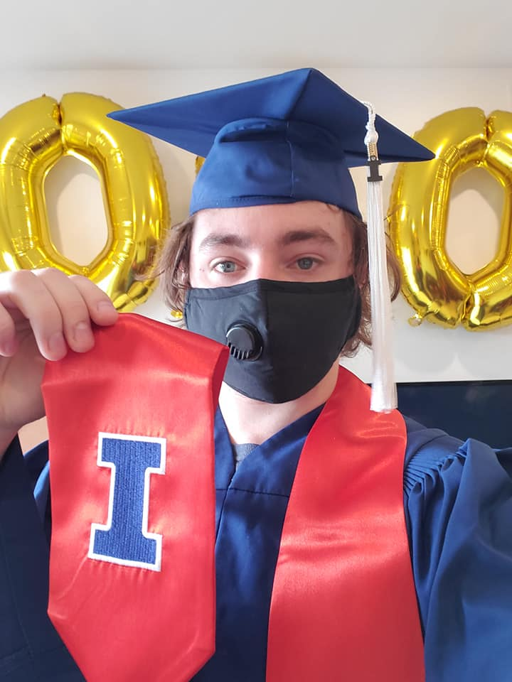

# About Me

## [Homepage](https://ctmurphey.github.io) | [Research](http://ctmurphey.github.io/research) | [Other Projects](http://ctmurphey.github.io/projects) | [Outreach](https://ctmurphey.github.io/outreach) | [Contact](http://ctmurphey.github.io/contact)

## [My CV](https://ctmurphey.github.io/photos/CV-ChaunceyMurphey.pdf)
**(Currently out of date, will be updated eventually)**

## University of Illinois (PhD)
I returned to UIUC after a 3-year haitus to work with professor Gautham Narayan searching for supernovae across the night sky. I'm now part of the *Young Supernova Experiment* (YSE) and *SIRAH* collaborations. For both, I'm leading the processing of images from the Dark Energy Camera (DECam), turning these images of esupernovae into plots of their brightness over time (light curves). I'm hoping that this work leads to at least two or three papers by the end of 2025, so stay tuned!

## Stony Brook University
I obtained a Masters in Physics at Stony Brook University, as well as a Certificate in Advance Data and Computational Science, in May 2023. Researching under professor Will Farr, I've had the priveledge to be part of the Gravitational Wave Group at the Flatiron Institute's Center For Computational Astrophysics (CCA). In my research, I do mass function cosmology using publicly available LIGO data. In particular, I use the overabundance of black holes with masses around 35Msun to put constraints on the Hubble constant and other cosmic parameters much faster than the methods LIGO employs themselves.

Growing up an avid baseball fan, for fun I've recently started diving into data analytics for the sport. My first project for it, the final project for a data science class I took in the Spring 2022 semester, was to test how well different machine learning models were able to calculate which players were Hall of Famers based on their career and season-level statistics. I also wrote a code that fetches the season results data for specific MLB teams and breaks them down vs individual opponents.

## University of Illinois (undergraduate)
I attended the University of Illinois at Urbana-Champaign from 2016 to 2020, where I graduated with a B.S in Astronomy, double minoring in Physics and Computer Engineering. While there, I did research under professor Brian Fields in galactic supernova distributions. The culmination of this research resulted in my first primary authorship with [this paper](https://arxiv.org/abs/2012.06552), which was also publised in the [*Monthly Notices of the Royal Astronomical Society*](https://academic.oup.com/mnras/article-abstract/507/1/927/6330468?redirectedFrom=fulltext). Outside of this paper, I also participated in a [collaborative white paper](https://arxiv.org/abs/1811.12433v1) urging the Legacy Survey of Space and Time to not ignore the Galactic plnce with their cadence by discussing several potential research opportuinites the LSST can provide. The (poorly organized) repository for that research code can be found [here](https://github.com/ctmurphey/Undergrad-Research).

Outside of classes and research, I also participated in my university's robotics club: iRobotics. More specifically, not only participated in Robobrawl, an international combat robotics competition, but also helped organize and run the event. The event featured college students from the US and Canada as well as alumni from UIUC. In my time involved with the competition, it grew from 8 to 16 teams and went from a small sideshow at UIUC's Engineering Open House to one of the largest amatuer combat robotics competitions in the country.

