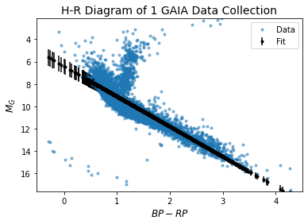
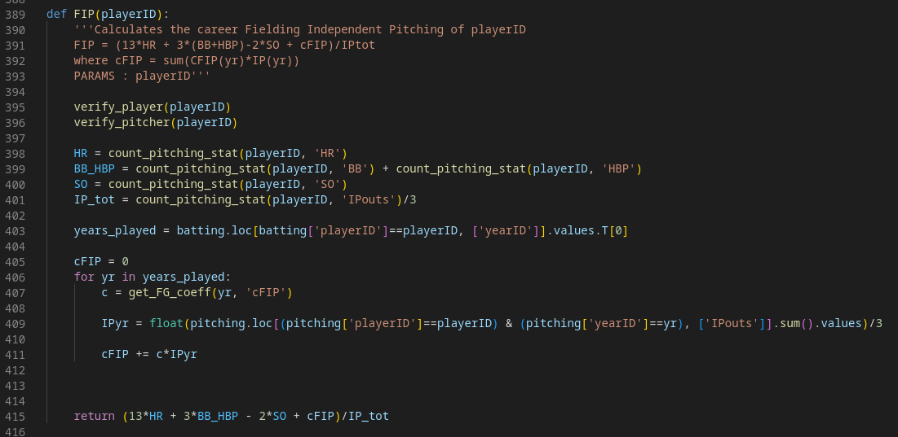
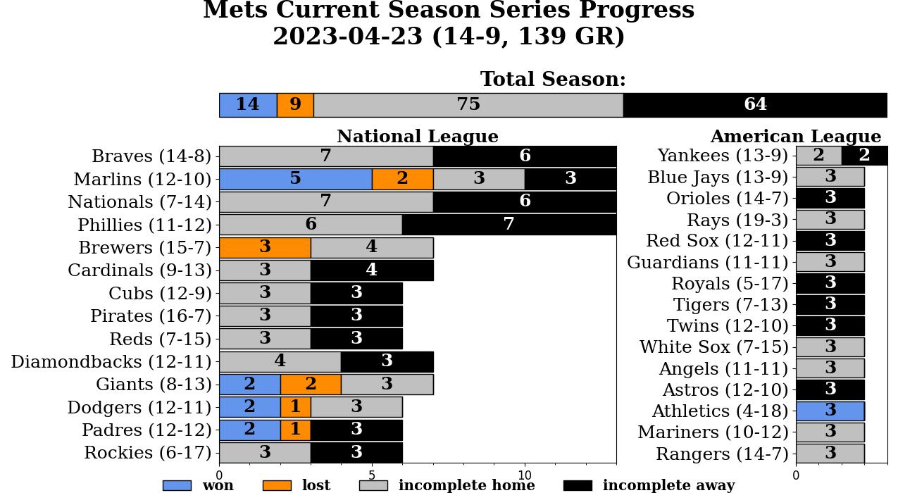

# Side Projects

## [Homepage](https://ctmurphey.github.io) | [About Me](https://ctmurphey.github.io/about) | [Research](https://ctmurphey.github.io/research) | [Contact](http://ctmurphey.github.io/contact)

## Hertzsprung-Russell Fitting with GAIA Data [Github Repo](https://github.com/ctmurphey/H-R-Analysis)
My final project in my graduate-level Stellar Astrophysics class I took in Fall 2021. I took a small section of data from the most recent GAIA release and used Markov Chain-Monte Carlo (MCMC) to fit a power law to the main sequence line of the H-R diagram of the distance modulus-adjusted data. After a simple fit to the entire data produced an understandably poor line, a secondary distribution was added to filter our non-MS stars, making a much better fit to the correct data.

## Machine Learning Baseball Hall of Fame Inductions [Github Repo](https://github.com/tannermurphey/ML-BaseballHoF)
My final project for a graduate-level Data Science class I took in Spring 2022. After preprocessing data from [Sean Lahman's Baseball Database](https://www.seanlahman.com/baseball-archive/statistics) and aggregating the players' season-by-season numbers into career-level tallies, 5 different machine learning models are trained and tested to learn which players get inducted into the Hall of Fame. The models were compared next to each other with two different combinations of player stats.

## Current MLB Data Visualization [GitHub Repo](https://github.com/ctmurphey/baseball)
An expanding collection of smaller "just for fun" projects centered around current stats for Major League Baseball. The first project, `mets-season-series`, tracks how the New York Mets (my favorite team) are doing vs the different opponents they face throughout the season. More code will undoubtably come when I come up with the inspitation for them.

